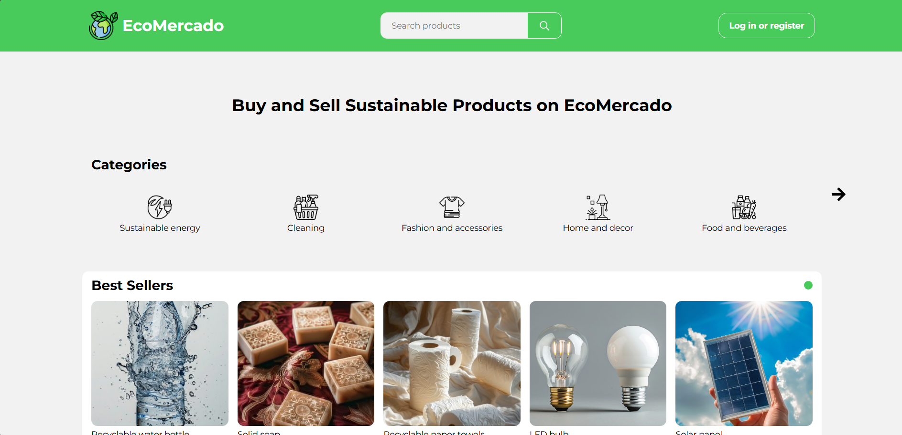
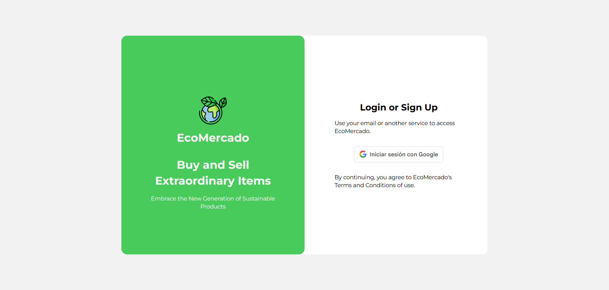

# Acerca de EcoMercado



## Descripción

Plataforma de comercio electrónico especializada en productos sostenibles. Incluye autenticación de usuario, carrito de compras funcional, búsqueda avanzada con filtrado y paginación, sistema CRUD de productos para vendedores y panel administrativo completo.

Este proyecto marcó mi primer paso en desarrollo web full stack. Inicialmente desarrollado con SCSS, ha sido mejorado y expandido continuamente con funcionalidades más robustas y arquitectura profesional.

## Demo

[Ver demo en vivo](https://eco-mercado.vercel.app/)

## Características

- Autenticación segura de usuario usando google OAuth 2.0
  
- Búsqueda avanzada con filtrado y paginación de productos
- Carrito de compras funcional
- Modulo de pagos simulado
- CRUD de productos para vendedores
- Panel administrativo
- Catálogo de productos sostenibles
- Opciones de perfil

## Capturas de pantalla

## Tecnologías


## Instalación Local (Opcional)

```bash
git clone https://github.com/WilloAndru/EcoMercado.git
```
